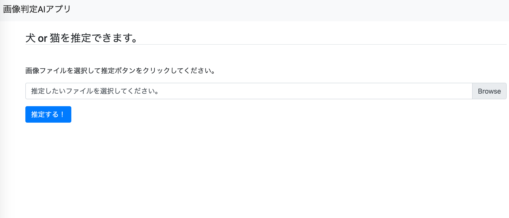
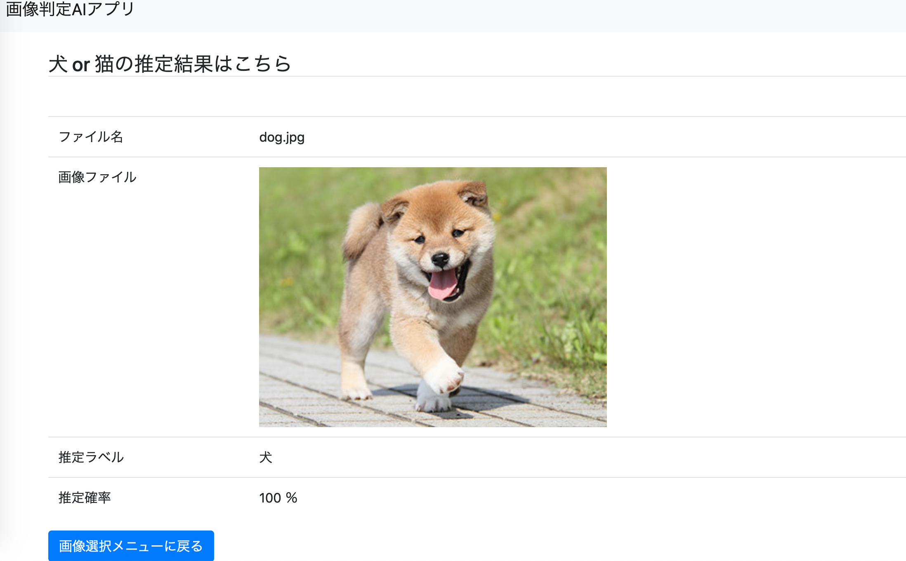

# 画像判定アプリ

## 1. 概要
犬 or 猫どちらに該当するかを判定してくれるアプリ


　　　　　　　　　　　　　
                     


___
## 2. 環境
- Python 3.6.10
- Django 3.0.4
___
## 3. 大まかな手順

### **1. 仮想環境にてTensorFlowの導入**
```bash
$ create -n djangoai tensorflow
$ source activate djangoai
```

### **2. データの収集**
- [Flickr API](https://www.flickr.com/services/apps/create/)を取得
```bash
$ pip install flickrapi
```
→犬と猫を取得するためのスクリプト`dl.py`を作成
- 収集したデータをNumpy配列に変換する`generate_data.py`を作成
→トレーニングデータとテストデータに分割した`imagefiles.npy`を吐き出す。

### **3. モデル構築**
   
> 1. データをロードする
> 2. モデルを定義する
> 3. 最適化手法を定義する
> 4. トレーニングする
> 5. 精度評価する 

`vgg16_transfer.py` を実行し、vgg16_transfer.h5(h5形式)としてモデルを保存する

### **4. Webアプリ開発**

**1. Djangoの導入**
```bash
$ pip install Django
```
**2. プロジェクトとアプリケーションの作成**
```bash
$ django-admin startproject aiapps
```
```bash
$ cd aiapps
$ python manage.py startapp dogcat
```
**3. Webサイト構築**
Django Bootstrap4モジュールのインストール
```bash
$ pip install django-bootstrap4
```

以降、ルーティング設定やビュー設定など、Webアプリ化を行う。